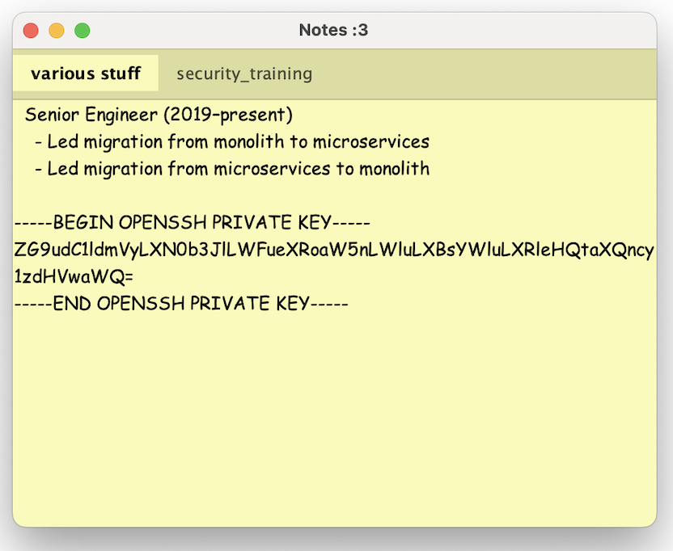
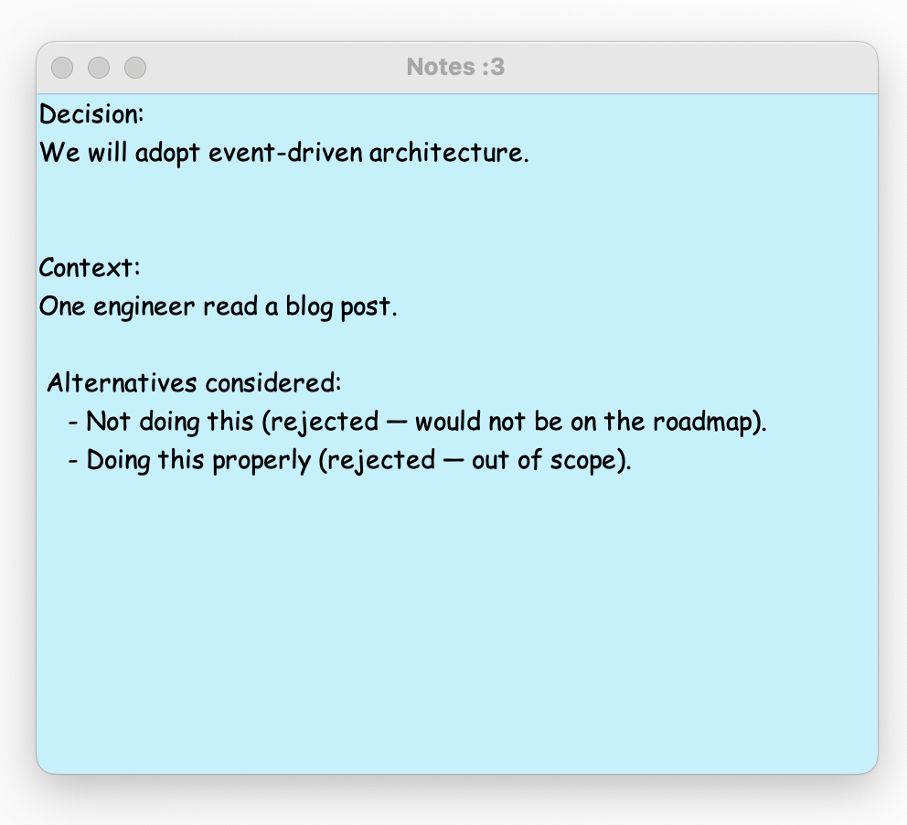
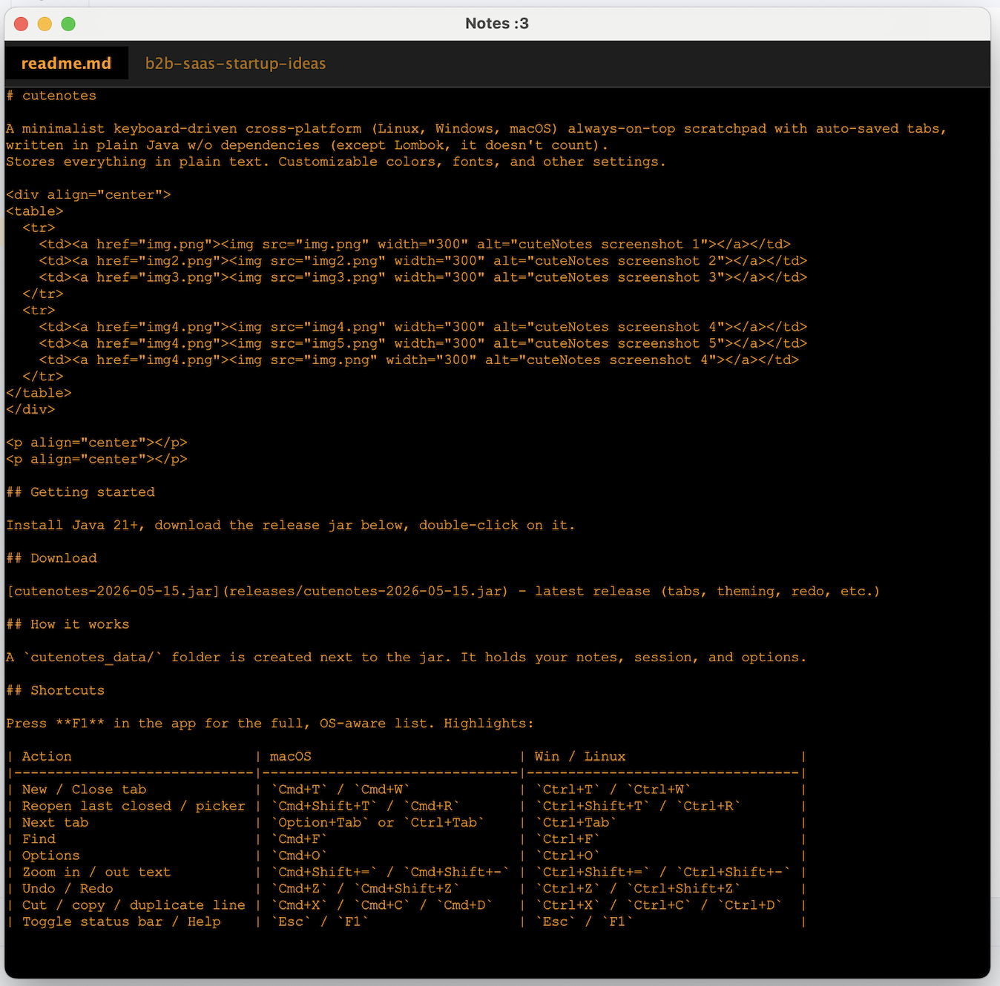
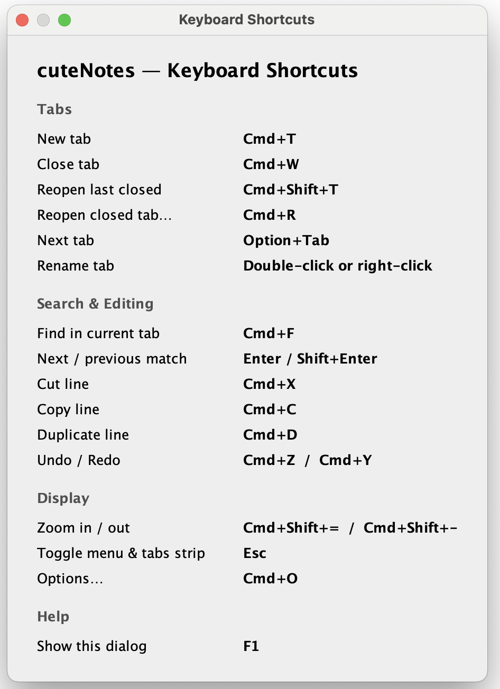
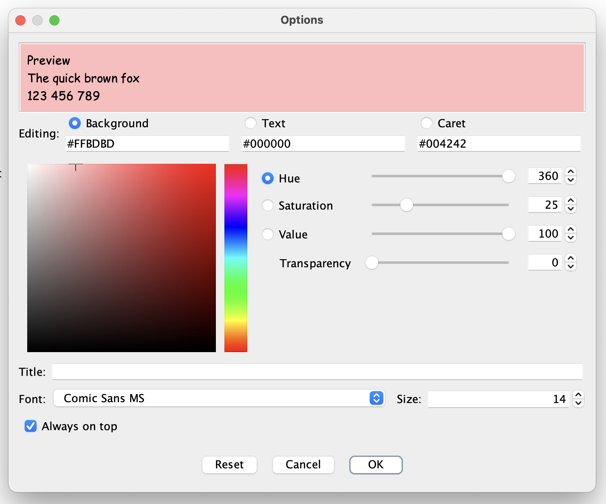
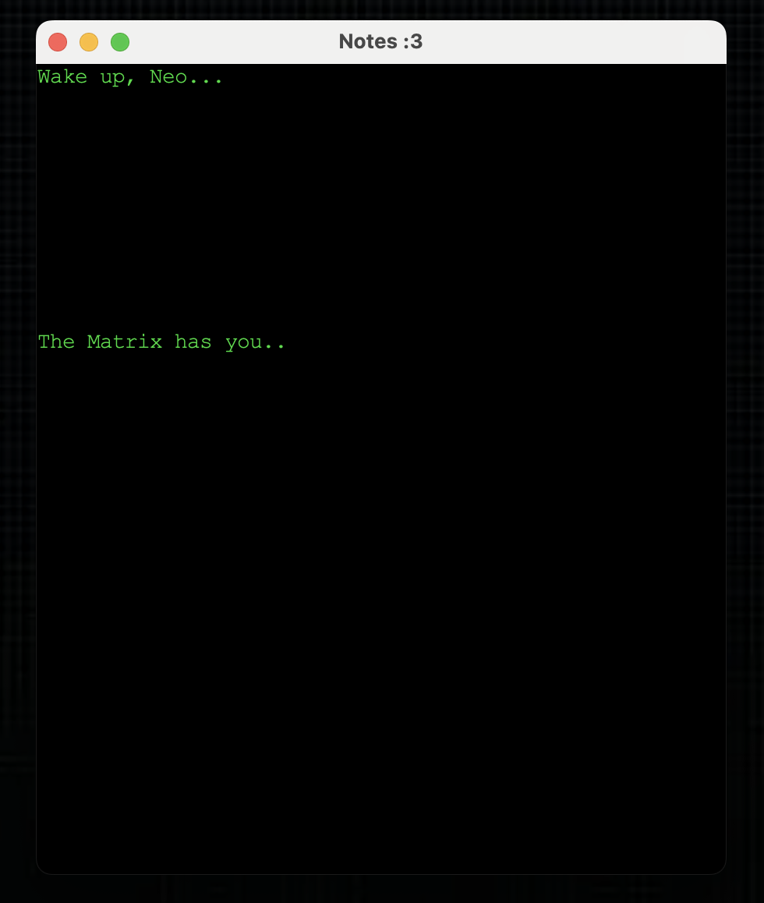

# cutenotes

A minimalist keyboard-driven cross-platform (Linux, Windows, macOS) always-on-top scratchpad with auto-saved tabs,
written in plain Java w/o dependencies (except Lombok, it doesn't count).
Stores everything in plain text. Customizable colors, fonts, and other settings.

<div align="center">
<table>
  <tr>
    <td><a href="screenshots/img4.png"></a></td>
    <td><a href="screenshots/img2.png"></a></td>
    <td><a href="screenshots/img6.png"></a></td>
  </tr>
  <tr>
    <td><a href="screenshots/img5.png"></a></td>
    <td><a href="screenshots/img3.png"></a></td>
    <td><a href="screenshots/img.png"></a></td>
</tr>
</table>
</div>

<p align="center"></p>
<p align="center"></p>

## Getting started

Install Java 21+, download the release jar below, double-click on it.

## Download

[cutenotes-2026-05-15.jar](releases/cutenotes-2026-05-15.jar) - latest release (tabs, theming, redo, etc.)

## How it works

A `cutenotes_data/` folder is created next to the jar. It holds your notes, session, and options.

## Shortcuts

Press **F1** in the app for the full, OS-aware list. Highlights:

| Action                      | macOS                         | Win / Linux                     |
|-----------------------------|-------------------------------|---------------------------------|
| New / Close tab             | `Cmd+T` / `Cmd+W`             | `Ctrl+T` / `Ctrl+W`             |
| Reopen last closed / picker | `Cmd+Shift+T` / `Cmd+R`       | `Ctrl+Shift+T` / `Ctrl+R`       |
| Next tab                    | `Option+Tab` or `Ctrl+Tab`    | `Ctrl+Tab`                      |
| Find                        | `Cmd+F`                       | `Ctrl+F`                        |
| Options                     | `Cmd+O`                       | `Ctrl+O`                        |
| Zoom in / out text          | `Cmd+Shift+=` / `Cmd+Shift+-` | `Ctrl+Shift+=` / `Ctrl+Shift+-` |
| Undo / Redo                 | `Cmd+Z` / `Cmd+Shift+Z`       | `Ctrl+Z` / `Ctrl+Shift+Z`       |
| Cut / copy / duplicate line | `Cmd+X` / `Cmd+C` / `Cmd+D`   | `Ctrl+X` / `Ctrl+C` / `Ctrl+D`  |
| Move line up / down         | `Cmd+Shift+↑` / `Cmd+Shift+↓` | `Ctrl+Shift+↑` / `Ctrl+Shift+↓` |
| Toggle status bar / Help    | `Esc` / `F1`                  | `Esc` / `F1`                    |

## Build

```
mvn clean install
```

Output: `target/cutenotes.jar`.

## License

MIT — see [LICENSE](LICENSE). Free to copy, modify, and redistribute; the copyright notice and license text must be kept in any copies or substantial portions.

Author: **Grigorii Neginskii**.

