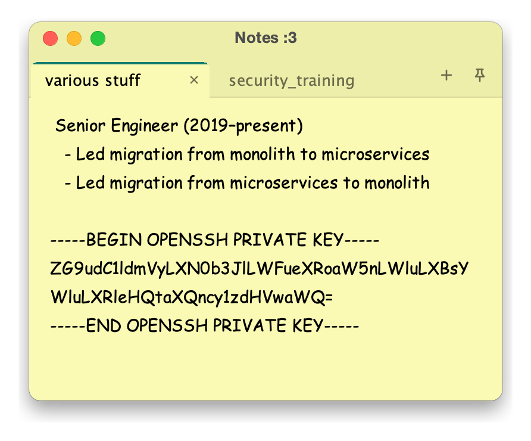
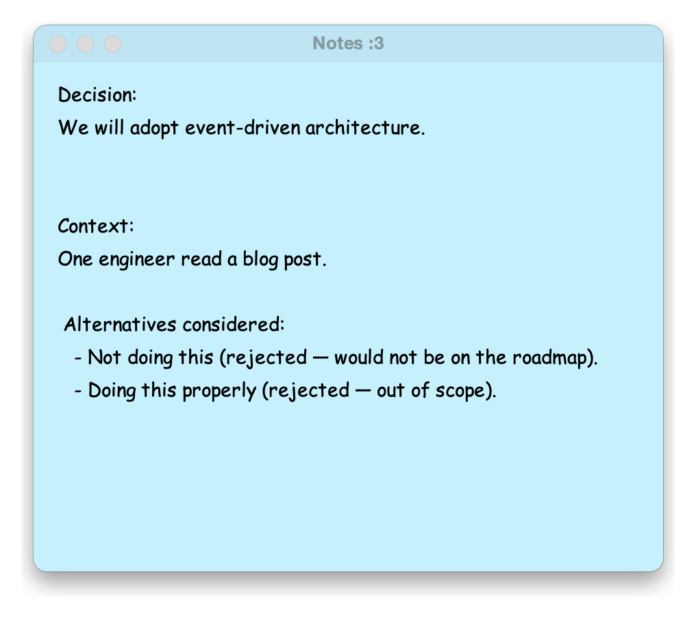
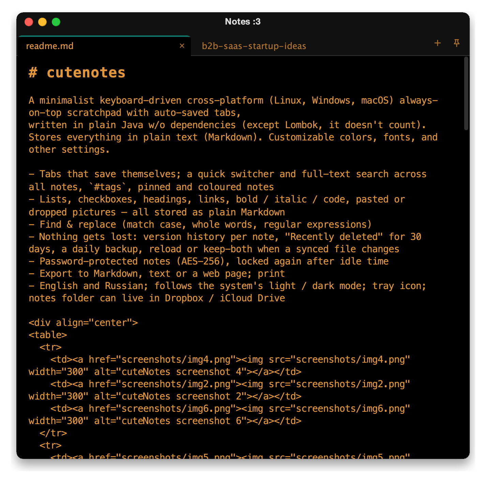
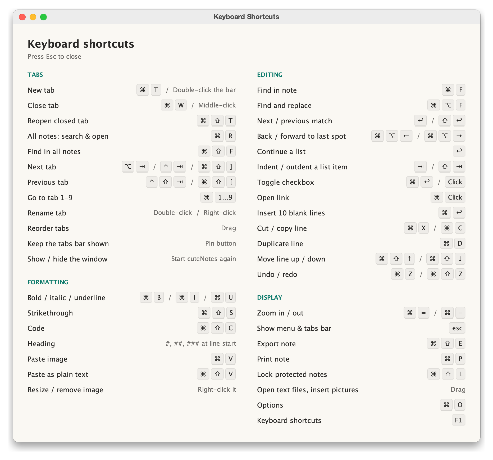
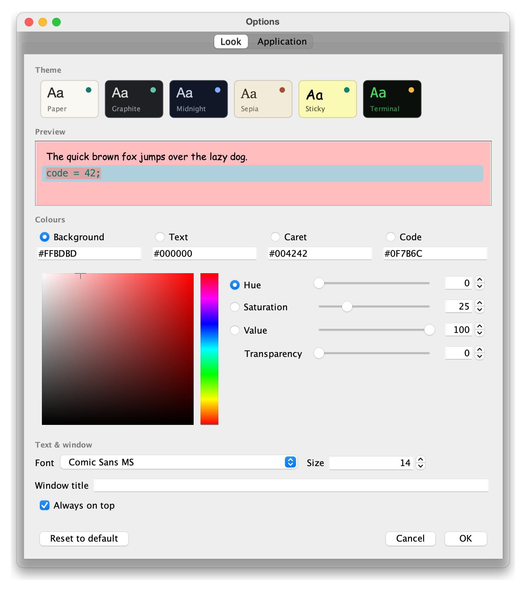
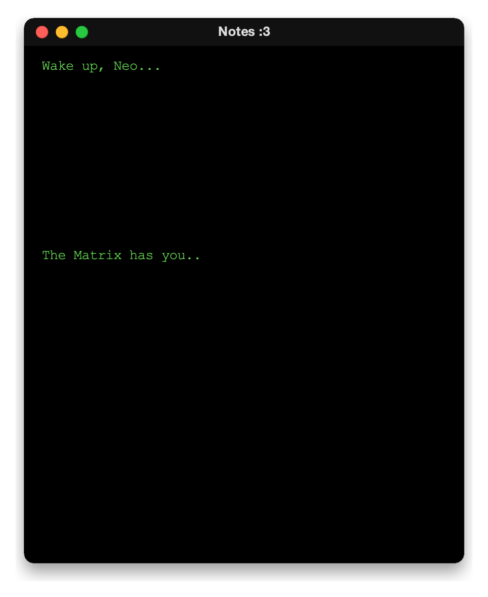

# cutenotes

A minimalist keyboard-driven cross-platform (Linux, Windows, macOS) always-on-top scratchpad with auto-saved tabs,
written in plain Java w/o dependencies (except Lombok, it doesn't count).
Stores everything in plain text. Customizable colors, fonts, and other settings.

<div align="center">
<table>
  <tr>
    <td><a href="screenshots/img4.png"></a></td>
    <td><a href="screenshots/img2.png"></a></td>
    <td><a href="screenshots/img6.png"></a></td>
  </tr>
  <tr>
    <td><a href="screenshots/img5.png"></a></td>
    <td><a href="screenshots/img3.png"></a></td>
    <td><a href="screenshots/img.png"></a></td>
</tr>
</table>
</div>

<p align="center"></p>
<p align="center"></p>

## Getting started

Download the build for your system below: it ships with its own Java runtime, nothing else to install.
Or, with Java 21+ installed, download the jar and double-click it.

## Download

| System | Download | Start |
|--------|----------|-------|
| macOS (Apple silicon) | [cutenotes-2026-09-26-1-mac-arm64.zip](releases/mac-arm/cutenotes-2026-09-26-1-mac-arm64.zip) | Unzip, move `cuteNotes.app` to Applications, open it (first start: System Settings → Privacy & Security → Open Anyway) |
| Windows x64 | [cutenotes-2026-09-26-1-windows-x64.zip](releases/windows/cutenotes-2026-09-26-1-windows-x64.zip) | Unzip, double-click `cuteNotes.bat` |
| Linux x64 | [cutenotes-2026-09-26-1-linux-x64.tar.gz](releases/linux/cutenotes-2026-09-26-1-linux-x64.tar.gz) | `tar -xzf`, run `./cutenotes/cutenotes` |
| Any OS with Java 21+ | [cutenotes-2026-09-26-1.jar](releases/cutenotes-2026-09-26-1.jar) | Double-click, or `java -jar` |

## How it works

The apps keep your notes, session and options in `cutenotes_data/` in your home folder, so updating the app keeps them.
The plain jar is portable: its `cutenotes_data/` folder sits next to the jar.
Moving from the jar to an app? Copy that folder into your home folder.

Build all four downloads with `scripts/build-releases.sh <YYYY-MM-DD>` (on an Apple-silicon Mac with Corretto).

## Shortcuts

Press **F1** in the app for the full, OS-aware list. Highlights:

| Action                      | macOS                         | Win / Linux                     |
|-----------------------------|-------------------------------|---------------------------------|
| New / Close tab             | `Cmd+T` / `Cmd+W`             | `Ctrl+T` / `Ctrl+W`             |
| Reopen last closed          | `Cmd+Shift+T`                 | `Ctrl+Shift+T`                  |
| All notes: search & open    | `Cmd+R`, type, `Enter`        | `Ctrl+R`, type, `Enter`         |
| Close tab with the mouse    | Middle-click or hover ×       | Middle-click or hover ×         |
| Next tab                    | `Option+Tab` or `Ctrl+Tab`    | `Ctrl+Tab`                      |
| Find                        | `Cmd+F`                       | `Ctrl+F`                        |
| Options                     | `Cmd+O`                       | `Ctrl+O`                        |
| Zoom in / out text          | `Cmd+=` / `Cmd+-`             | `Ctrl+=` / `Ctrl+-` (or numpad `+`/`-`) |
| Undo / Redo                 | `Cmd+Z` / `Cmd+Shift+Z`       | `Ctrl+Z` / `Ctrl+Shift+Z`       |
| Cut / copy / duplicate line | `Cmd+X` / `Cmd+C` / `Cmd+D`   | `Ctrl+X` / `Ctrl+C` / `Ctrl+D`  |
| Move line up / down         | `Cmd+Shift+↑` / `Cmd+Shift+↓` | `Ctrl+Shift+↑` / `Ctrl+Shift+↓` |
| Back / forward to last spot | `Cmd+Option+←` / `Cmd+Option+→` | `Alt+←` / `Alt+→`             |
| Bold / Italic / Underline   | `Cmd+B` / `Cmd+I` / `Cmd+U`   | `Ctrl+B` / `Ctrl+I` / `Ctrl+U`  |
| Strikethrough               | `Cmd+Shift+S`                 | `Ctrl+Shift+S`                  |
| Code (monospace)            | `Cmd+Shift+C`                 | `Ctrl+Shift+C`                  |
| Paste image                 | `Cmd+V`                       | `Ctrl+V`                        |
| Toggle status bar / Help    | `Esc` / `F1`                  | `Esc` / `F1`                    |

## Build

```
mvn clean install
```

Output: `target/cutenotes.jar`.

# Release notes
2026-Sep-26-1 (details in [docs/release_notes](docs/release_notes/2026-09-26-native-builds.md)):
- Downloads for macOS (Apple silicon), Windows x64 and Linux x64 that bundle their own Java runtime: no JDK needed
- The apps keep notes in `~/cutenotes_data`, so updating an app never deletes them; the plain jar stays portable
- `scripts/build-releases.sh` builds the jar and all three native downloads in one go

2026-Sep-26 (details in [docs/release_notes](docs/release_notes)):
- Six theme presets in Options (Paper, Graphite, Midnight, Sepia, Sticky, Terminal); new default "Paper" look
- Redesigned tabs: raised active tab, close on hover or middle-click, "+" button, Close other tabs
- `Cmd/Ctrl+R` is a quick switcher: type to filter, `Enter` to open; relative dates and icons
- Roomier editor (padding, line spacing), themed selection and scrollbars, rounded find bar
- Key-cap help (F1), fading status toasts, smooth animations, remembered window size and position
- Move line up / down (`Cmd/Ctrl+Shift+↑/↓`) works like IntelliJ: moves the whole selection as a block, keeps it selected, no view jumps, one undo step
- Cross-platform: native look on Windows, platform-safe shortcuts (`Ctrl+Tab`, `Alt+←/→` on Windows/Linux), zoom with `Ctrl+=`/`Ctrl+-` or numpad on any keyboard layout, installed monospace fonts for code
- Reliability fixes from the critical bug review (autosave, atomic writes, single instance, clean exit)

2026-Jun-05:
- Back / forward caret navigation across visited spots (`Cmd/Ctrl+Alt+←/→`), like an IDE
- Configurable code-section colour with an auto, theme-aware background
- Rich text: **bold**, *italic*, underline, ~~strikethrough~~ and `code` (`Cmd/Ctrl+B/I/U`, `Cmd/Ctrl+Shift+S`, `Cmd/Ctrl+Shift+C`), stored as Markdown
- Paste images from the clipboard (`Cmd/Ctrl+V`); saved in `cutenotes_data/images`, resize or remove via right-click, move by dragging
- Nested groups in the `Cmd/Ctrl+R` window: drag notes/groups to regroup, reorder notes, rename inline, right-click menu, delete with confirmation
- Pin button (📌) to keep the tabs bar visible

2026-Jun-03:
- Case-insensitive search (toggle for case-sensitive)
- Forward / backward buttons in the search bar
- Note groups (folders) in the `Cmd/Ctrl+R` window
- `Cmd/Ctrl+Enter` inserts 10 blank lines

## License

MIT — see [LICENSE](LICENSE). Free to copy, modify, and redistribute; the copyright notice and license text must be kept in any copies or substantial portions.

Author: **Grigorii Neginskii**.

